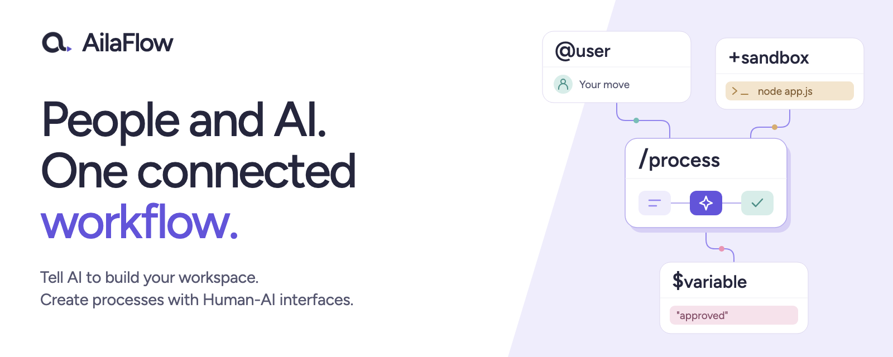
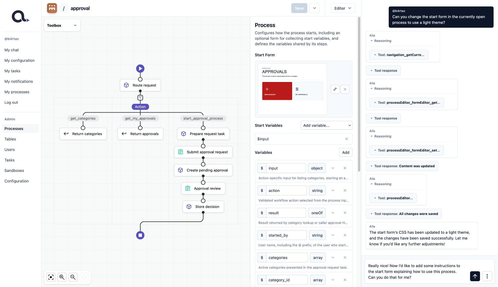

[](https://ailaflow.com)

# AilaFlow

 <a href="https://www.npmjs.com/package/@ailaflow/cli"></a>

**Tell AI to build your workspace, powered by processes with Human-AI interfaces.**

AilaFlow is a collaborative low-code workspace where people and AI agents design, automate, and execute business processes together. Processes can combine human tasks, AI agents, forms, scripts, shared data, and external systems-giving humans and AI a common way to participate in the same workflow and act on the same process state.

Let AI build your processes, including integrations with external systems using Node.js and NPM packages, with the code running safely in isolated sandboxes. Bring AilaFlow into your existing workflow through Slack and Telegram.

Learn more at [ailaflow.com](https://ailaflow.com).

## How AilaFlow works

[](.github/portal-screenshot.png)

- **Admins build the workspace.** Administrators use AI to create and manage processes that define how work gets done. Regular users execute the processes available to them.

- **Processes are permission-aware.** Administrators decide which processes are available to specific users or groups, and can keep selected actions human-only-so sensitive decisions, approvals, or operations remain under explicit human control.

- **Every user works with their own AI.** Each user has a personal AI chat that can understand requests and execute the processes they have access to.

- **Human-AI interfaces use the same processes.** A process can be operated through AI chat or provide its own HTML interface and forms for desktop and mobile-allowing people and AI to act through the same underlying workflow.

- **Process code runs in isolated sandboxes.** Scripts and integrations execute in separate sandboxed environments, allowing processes to use Node.js and NPM packages while keeping execution isolated from the host and other sandboxes.

## Quick Setup

AilaFlow requires Docker to be installed on your system.

Start AilaFlow with:

```bash
npm install -g @ailaflow/cli
ailaflow serve
```

Then open:

```text
http://localhost:2048/install
```

and follow the installation steps.

After logging in, open **Configuration**. AilaFlow will show you what still needs to be configured, including AI access and the public URL used to make your workspace accessible externally.

## Chat integrations

Connect your preferred chat platform to AilaFlow, then send requests and run the processes available to you without leaving the conversation. We currently support:

- Telegram
- Slack

## License

AilaFlow is distributed under the [AilaFlow Fair-Code License 1.0](./LICENSE.md).

Home use is free, including personal, educational, and eligible non-profit use. AilaFlow is also free for professional teams with up to 3 Authorized Users. See the [LICENSE.md](./LICENSE.md) for the complete terms.

## Contributing

Contributions are welcome. Please read [CONTRIBUTING.md](./CONTRIBUTING.md) before submitting changes or opening a pull request.
